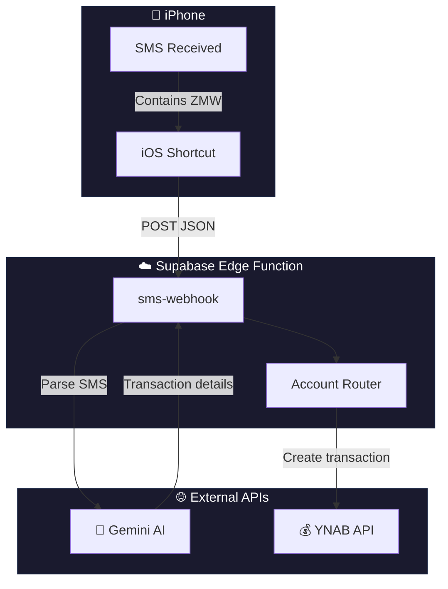
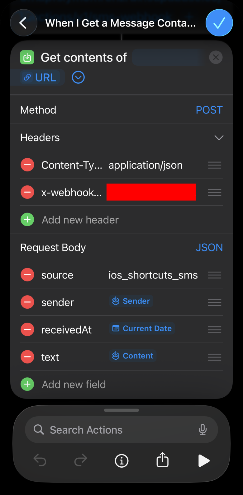
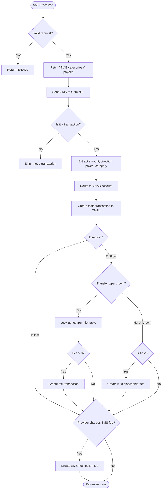

# YNAB SMS Ingestion (Supabase Edge + Gemini AI)

Automatically captures transaction SMS messages from Zambian banks and mobile money services, then imports them into YNAB (You Need A Budget).

**Powered by a Hybrid Architecture** — deterministic code extraction + Gemini AI for context understanding.

## System Architecture


```mermaid
flowchart TD
    subgraph Phone["📱 iPhone"]
        SMS["SMS Received"]
        Shortcut["iOS Shortcut"]
    end

    subgraph Supabase["☁️ Supabase Edge Function"]
        Webhook["sms-webhook"]
        Router["Account Router"]
    end

    subgraph External["🌐 External APIs"]
        Gemini["🤖 Gemini AI"]
        YNAB["💰 YNAB API"]
    end

    SMS -->|"Contains ZMW"| Shortcut
    Shortcut -->|"POST JSON"| Webhook
    Webhook -->|"Parse SMS"| Gemini
    Gemini -->|"Transaction details"| Webhook
    Webhook --> Router
    Router -->|"Create transaction"| YNAB

    style Phone fill:#1a1a2e,stroke:#16213e,color:#fff
    style Supabase fill:#1a1a2e,stroke:#16213e,color:#fff
    style External fill:#1a1a2e,stroke:#16213e,color:#fff
```

### Flow breakdown

| Step | Component | Action |
|------|-----------|--------|
| 1 | **iPhone** | Receives SMS from bank/mobile money |
| 2 | **iOS Shortcut** | Triggers on "ZMW" keyword, sends to webhook |
| 3 | **Edge Function** | Validates request, fetches YNAB categories/payees |
| 4 | **Gemini AI** | Parses SMS, extracts amount/direction/payee/category |
| 5 | **Router** | Maps SMS sender to correct YNAB account |
| 6 | **YNAB API** | Creates transaction (+ fee transactions if applicable) |

## Hybrid Architecture

This system uses a **Code + AI hybrid approach** for maximum accuracy:

### CODE handles deterministic data (fast, reliable, 100% accurate)
- 💰 **Amount extraction** — regex patterns for "ZMW 100.00", "K1,234.56"
- 💵 **Balance extraction** — "Your bal is", "available balance is"
- ⏰ **Time extraction** — "14:30", "as at 09/01/2026 01:40"
- 📱 **Phone/network detection** — Zambian prefixes (97=Airtel, 96=MTN, 95=Zamtel)
- 🏷️ **Transfer type** — "at POS" → pos, "Debit Card transaction" → withdrawal
- 🔗 **Payee aliases** — "PNZ Lusaka Securities ATM" → "LuSE"

### AI handles contextual understanding (smart, flexible)
- ❓ **Is this a transaction?** — distinguishes real transactions from promos/OTPs
- ↔️ **Direction** — inflow (received) vs outflow (sent/paid)
- 👤 **Payee matching** — fuzzy-matches to existing YNAB payees
- 🏷️ **Category suggestion** — matches against your YNAB categories
- 📝 **Action verb** — "Sent", "Received", "Purchased" for memo

### Why hybrid?

| Approach | Pros | Cons |
|----------|------|------|
| **Pure AI** | Flexible | Slow, expensive, can hallucinate numbers |
| **Pure regex** | Fast, precise | Brittle, breaks on format changes |
| **Hybrid** ✅ | Best of both! | More code to maintain |

The hybrid approach ensures:
- ✅ **Numbers are always correct** — code extraction, not AI guessing
- ✅ **Context is understood** — AI determines if it's a real transaction
- ✅ **Faster responses** — smaller AI prompts, less work for AI
- ✅ **Lower costs** — fewer tokens = cheaper API calls

## Features

- 🤖 **AI-powered parsing** — Gemini understands context, not just patterns
- 💰 **Smart amount extraction** — Gets transaction amount, not balance
- ↔️ **Direction detection** — Knows inflow vs outflow from context
- 👤 **Smart payee matching** — Matches existing YNAB payees only
- 🏷️ **Smart category matching** — Matches against your actual YNAB categories
- 📝 **Clean memos** — AI generates detailed, organized memos
- 🏦 **Multi-account routing** — Routes by SMS sender or account ending
- 🔄 **Deduplication** — Same SMS won't create duplicate transactions
- ✋ **Manual approval** — Transactions need your approval in YNAB
- 💸 **Automatic fee tracking** — Creates separate fee transactions

## Supported banks/services

Out of the box, this project supports:

- **Airtel Money** (sender: `AirtelMoney`)
- **MTN MoMo** (sender: `MoMo`)
- **Zamtel Money** (sender: `115`)
- **ABSA Bank** (sender: `Absa`, `ABSA_ZM`)
- **Standard Chartered** (sender: `StanChart`, `StanChartZM`)

Add more by editing `config.ts`.

## Repository layout

```
supabase/
├── functions/
│   ├── sms-webhook/
│   │   ├── index.ts          # Main webhook handler
│   │   └── deno.json         # Deno config
│   └── _shared/
│       ├── extractors.ts     # 📊 Code-based data extraction (amount, balance, time, phone)
│       ├── payee-aliases.ts  # 🏷️ Merchant name → YNAB payee mapping
│       ├── gemini.ts         # 🤖 Hybrid AI client (code + AI)
│       ├── fee-calculator.ts # 💸 Transaction fee calculation
│       ├── config.ts         # ⚙️ Sender→account mappings
│       ├── parsers.ts        # Utility functions
│       ├── routing.ts        # Account routing logic
│       ├── ynab.ts           # YNAB API client
│       └── ynab-lookup.ts    # Account/Category/Payee lookup
└── config.toml               # Supabase project config
```

## Quick start

### 1. Fork and clone

```bash
git clone <your-fork-url>
cd ynab-sms-solution
```

### 2. Set up Supabase

1. Create a [Supabase](https://supabase.com) project
2. Install the [Supabase CLI](https://supabase.com/docs/guides/cli)
3. Link your project: `supabase link --project-ref <your-project-ref>`

### 3. Get your API keys

**YNAB:**
1. Create a YNAB personal access token: **YNAB → Settings → Developer Settings → New Token**
2. Find your budget ID in the YNAB web app URL:
   ```
   https://app.ynab.com/xxxxxxxx-xxxx-xxxx-xxxx-xxxxxxxxxxxx/budget
                        ^^^^^^^^^^^^^^^^^^^^^^^^^^^^^^^^^^^^
                        This is your budget ID
   ```

**Gemini AI:**
1. Go to [Google AI Studio](https://aistudio.google.com/app/apikey)
2. Click **Create API Key**
3. Copy the key

### 4. Set secrets in Supabase

```bash
# Generate a random webhook secret
openssl rand -base64 32

# Set all secrets
supabase secrets set WEBHOOK_SECRET=<your-random-secret>
supabase secrets set YNAB_TOKEN=<your-ynab-token>
supabase secrets set YNAB_BUDGET_ID=<your-budget-id>
supabase secrets set GEMINI_API_KEY=<your-gemini-key>

# Optional: Map account endings to YNAB accounts
supabase secrets set ACCOUNT_ENDINGS='{"1234":"Savings Account","5678":"Current Account"}'

# Optional: Set your YNAB category name for transaction fees
supabase secrets set FEE_CATEGORY_NAME="Bank / Transaction Fees"
```

### 5. Configure sender mappings

Edit `supabase/functions/_shared/config.ts` to map SMS senders to your YNAB account names:

```typescript
export const SENDER_TO_ACCOUNT: Record<string, string> = {
  airtelmoney: "Airtel Money",   // Use YOUR YNAB account name
  momo: "MTN MoMo",
  absa: "My Bank Account",
};
```

### 6. Deploy

```bash
supabase functions deploy sms-webhook --no-verify-jwt
```

### 7. Configure iOS Automation

See [iOS Setup](#ios-setup) below.

## iOS Setup

This project uses an iOS Shortcut Automation to capture SMS messages and send them to Supabase.

### Step 1: Create the Shortcut Automation

1. Open the **Shortcuts** app
2. Go to the **Automation** tab
3. Tap **New Automation** → **Message**
4. Configure the trigger:
   - **Sender**: Any Sender
   - **Message Contains**: `ZMW`
   - **Run Immediately**: ✓ (checked)

<p align="center">
  
</p>

### Step 2: Configure the HTTP request

1. Search for **"URL"** and add your Supabase function URL
2. Search for **"Get Contents of URL"** and configure:
   - **Method**: POST
   - **Headers**:
     - `Content-Type`: `application/json`
     - `x-webhook-secret`: `<your-webhook-secret>`
   - **Request Body**: JSON with 4 fields:
     - `source`: `ios_shortcuts_sms`
     - `sender`: **Shortcut Input** → **Sender**
     - `receivedAt`: **Current Date**
     - `text`: **Shortcut Input** → **Content**

<p align="center">
  
</p>

### Step 3: Done!

Tap **Done** — the automation is now active.

## Testing

### With the test script

```bash
export WEBHOOK_SECRET=your-secret-here
./test-sms.sh "Money sent to John. Amount ZMW 100.00. Your bal is ZMW 500.00." "AirtelMoney"
```

### With curl

```bash
curl -X POST "https://<your-project>.supabase.co/functions/v1/sms-webhook" \
  -H "Content-Type: application/json" \
  -H "x-webhook-secret: your-secret" \
  -d '{
    "source": "test",
    "sender": "AirtelMoney",
    "receivedAt": "Jan 01, 2026 at 12:00",
    "text": "Money sent to John. Amount ZMW 100.00. Your bal is ZMW 500.00."
  }'
```

## Configuration

### Mapping SMS senders to accounts

Edit `config.ts`:

```typescript
export const SENDER_TO_ACCOUNT: Record<string, string> = {
  airtelmoney: "Airtel Money",
  momo: "MTN MoMo",
  absa: "ABSA Current",
};
```

### Adding account-ending hints

Some banks include "account ending XXXX" in SMS. Configure via Supabase secrets:

```bash
supabase secrets set ACCOUNT_ENDINGS='{"1234":"Savings","5678":"Current"}'
```

## How parsing works

When an SMS arrives, parsing happens in **3 stages**:

### Stage 1: Code extraction (deterministic)

Before calling AI, code extracts reliable data:

```typescript
// extractors.ts does this automatically:
{
  amount: 1020,              // From "ZMW 1020.00"
  balance: 2824.97,          // From "Your bal is ZMW 2824.97"
  time: "13:22",             // From timestamp or fallback
  transactionRef: "PP260103.1323.C60482",  // From "TID:"
  transferType: "same_network",  // From phone prefix (97 = Airtel)
}
```

### Stage 2: AI analysis (contextual)

AI receives a simplified prompt asking only for context:

| Field | What AI determines |
|-------|-------------------|
| Is transaction? | Real money movement or promo/OTP? |
| Direction | Inflow (received) or outflow (sent)? |
| Payee | Who is the person/business? |
| Category | Best match from your YNAB categories |
| Action | Verb for memo ("Sent", "Purchased", etc.) |

### Stage 3: Post-processing (code)

Code merges AI response with extractions:

1. **Override numbers** — code-extracted amount/balance always wins
2. **Apply aliases** — "PNZ Lusaka Securities ATM" → "LuSE"
3. **Format memo** — "[Action] [Payee] | [HH:MM] | Bal: [Balance]"

### Payee aliases

Edit `payee-aliases.ts` to map merchant names:

```typescript
// payee-aliases.ts
const PAYEE_ALIASES: Record<string, string> = {
  "pnz lusaka securities": "LuSE",
  "pnz lusaka securities atm": "LuSE",
  // Add more aliases here
};
```

| SMS Merchant | YNAB Payee |
|--------------|------------|
| PNZ Lusaka Securities ATM | LuSE |
| PNZ Lusaka Securities | LuSE |

**Note:** Payees are NEVER created automatically. If there's no match, the payee field stays blank.

## Processing Logic

This diagram shows how the system processes each SMS and decides what transactions to create:


```mermaid
flowchart TD
    Start([SMS Received]) --> Validate{Valid request?}
    Validate -->|No| Reject[Return 401/400]
    Validate -->|Yes| FetchYNAB[Fetch YNAB categories & payees]
    
    FetchYNAB --> CallAI[Send SMS to Gemini AI]
    CallAI --> IsTransaction{Is it a transaction?}
    
    IsTransaction -->|No| Skip[Skip - not a transaction]
    IsTransaction -->|Yes| ExtractData[Extract amount, direction, payee, category]
    
    ExtractData --> RouteAccount[Route to YNAB account]
    RouteAccount --> CreateMain[Create main transaction in YNAB]
    
    CreateMain --> CheckDirection{Direction?}
    
    CheckDirection -->|Inflow| CheckSMSFee{Provider charges SMS fee?}
    CheckDirection -->|Outflow| CheckTransferType{Transfer type known?}
    
    CheckTransferType -->|Yes| LookupFee[Look up fee from tier table]
    CheckTransferType -->|No/Unknown| CheckAbsa{Is Absa?}
    
    CheckAbsa -->|Yes| CreatePlaceholder[Create K10 placeholder fee]
    CheckAbsa -->|No| CheckSMSFee
    
    LookupFee --> FeeFound{Fee > 0?}
    FeeFound -->|Yes| CreateFee[Create fee transaction]
    FeeFound -->|No| CheckSMSFee
    
    CreatePlaceholder --> CheckSMSFee
    CreateFee --> CheckSMSFee
    
    CheckSMSFee -->|Yes| CreateSMSFee[Create SMS notification fee]
    CheckSMSFee -->|No| Done([Return success])
    
    CreateSMSFee --> Done
```

### Decision points explained

| Decision | Logic |
|----------|-------|
| **Is it a transaction?** | AI determines if SMS describes real money movement (not promos, OTPs, balance checks) |
| **Transfer type known?** | AI extracts type: `same_network`, `cross_network`, `to_mobile`, `withdrawal`, `pos`, etc. |
| **Is Absa?** | Absa SMS doesn't specify transfer type, so we create a K10 placeholder fee for unknown outflows |
| **Fee > 0?** | Some transfer types are free (e.g., airtime purchases, POS transactions) |
| **Provider charges SMS fee?** | Currently only Absa charges K0.50 per SMS notification |

## Transaction Fees

The system automatically creates separate fee transactions for mobile money transfers and bank transactions.

### Supported fee schedules

| Provider | Transfer Type | Status |
|----------|--------------|--------|
| Airtel | Same network | ✅ Configured (Jan 2025 rates) |
| Airtel | Bill/Till payment | ✅ K1.20 flat fee (e.g., NHIMA) |
| Airtel | Cross-network, to-bank | Placeholder |
| MTN | Same network | Placeholder |
| Absa Bank | To mobile money | ✅ K10 flat fee |
| Absa Bank | ATM withdrawal | ✅ K20 flat fee (detected via "Debit Card transaction") |
| Absa Bank | POS purchase | ✅ No fee (detected via "at POS") |
| Absa Bank | SMS notification | ✅ K0.50 per SMS |

### Airtel Money fees (January 2025)

Updated due to **Mobile Money Transaction Levy Act 2024** (effective Jan 1, 2025):

| Amount (ZMW) | Fee (ZMW) |
|--------------|-----------|
| 0 - 150 | K0.74 |
| 151 - 300 | K1.30 |
| 301 - 500 | K1.60 |
| 501 - 1,000 | K3.00 |
| 1,001 - 3,000 | K6.00 |
| 3,001 - 5,000 | K10.50 |
| 5,001 - 10,000 | K12.00 |

### Absa SMS detection patterns

| SMS Pattern | Detected As | Fee |
|-------------|-------------|-----|
| `"at POS"` | POS purchase | K0 |
| `"Debit Card transaction"` | ATM withdrawal | K20 |
| `"has been credited"` | Inflow | — |
| `"has been debited"` | Outflow (to mobile) | K10 |

### ATM withdrawals as transfers

ATM withdrawals are automatically recorded as **transfers to your Cash account** in YNAB (not regular outflows). This correctly reflects that the money moved from your bank to your wallet.

```
Absa Current  →  Transfer  →  Cash
     -K500          ↔          +K500
```

Configure the Cash account name (if different from "Cash"):
```bash
supabase secrets set CASH_ACCOUNT_NAME="My Cash Wallet"
```

> **Note:** ABSA fees vary by account type. The defaults are for Ultimate Plus accounts. Edit `fee-calculator.ts` for your account type.

### Configuring fee category

```bash
supabase secrets set FEE_CATEGORY_NAME="Bank / Transaction Fees"
```

### Adding new fee schedules

Edit `fee-calculator.ts`:

```typescript
same_network: {
  payee: "Airtel",
  category: FEE_CATEGORY_NAME,
  tiers: [
    { min: 0, max: 150, fee: 0.58 },
    { min: 150, max: 300, fee: 1.10 },
    // ... more tiers
  ],
},
```

## Environment variables

| Variable | Description | Required |
|----------|-------------|----------|
| `WEBHOOK_SECRET` | Random string to authenticate requests | Yes |
| `YNAB_TOKEN` | Your YNAB personal access token | Yes |
| `YNAB_BUDGET_ID` | The budget to post transactions to | Yes |
| `GEMINI_API_KEY` | Google Gemini API key | Yes |
| `ACCOUNT_ENDINGS` | JSON mapping of account endings → account names | No |
| `FEE_CATEGORY_NAME` | YNAB category name for fee transactions | No |
| `CASH_ACCOUNT_NAME` | YNAB account for ATM withdrawals (default: "Cash") | No |

## Auto-Reconciliation (ABSA)

ABSA transactions often have small balance discrepancies due to hidden fees, missed SMS notifications, or timing issues. The system automatically reconciles these differences.

### How it works

After each ABSA transaction:
1. **Extract balance** from SMS (e.g., "Your available balance is 5,161.02")
2. **Query YNAB** for the account's current cleared balance
3. **Subtract fees** we just created (SMS fee K0.50, transaction fees, etc.) from SMS balance
4. **Compare** — if difference > K0.01, create an adjustment transaction

> **Note:** The SMS balance is from *before* fees are charged. YNAB balance is *after* we created fee transactions. We account for this to avoid false adjustments.

### Example

```
SMS balance:  K5,161.02
YNAB balance: K5,106.34
Difference:   K54.68

→ Creates: +K54.68 "Unknown Adjustment" transaction
```

### Adjustment transactions

- **Payee**: "Unknown Adjustment"
- **Memo**: "Auto-reconciliation: SMS bal 5161.02, YNAB bal 5106.34"
- **Approved**: No (requires your review)

Review these transactions periodically to identify patterns (e.g., recurring fees you weren't aware of).


## License

MIT
