# YNAB SMS Ingestion (Supabase Edge + Gemini AI)

Automatically captures transaction SMS messages from Zambian banks and mobile money services, then imports them into YNAB (You Need A Budget).

**Powered by Google Gemini AI** for intelligent SMS parsing — no brittle regex rules!

## System Architecture

```mermaid
flowchart TD
    subgraph Phone["📱 iPhone"]
        SMS["SMS Received"]
        Shortcut["iOS Shortcut"]
    end

    subgraph Supabase["☁️ Supabase Edge Function"]
        Webhook["sms-webhook"]
        Router["Account Router"]
    end

    subgraph External["🌐 External APIs"]
        Gemini["🤖 Gemini AI"]
        YNAB["💰 YNAB API"]
    end

    SMS -->|"Contains ZMW"| Shortcut
    Shortcut -->|"POST JSON"| Webhook
    Webhook -->|"Parse SMS"| Gemini
    Gemini -->|"Transaction details"| Webhook
    Webhook --> Router
    Router -->|"Create transaction"| YNAB

    style Phone fill:#1a1a2e,stroke:#16213e,color:#fff
    style Supabase fill:#1a1a2e,stroke:#16213e,color:#fff
    style External fill:#1a1a2e,stroke:#16213e,color:#fff
```



### Flow breakdown

| Step | Component | Action |
|------|-----------|--------|
| 1 | **iPhone** | Receives SMS from bank/mobile money |
| 2 | **iOS Shortcut** | Triggers on "ZMW" keyword, sends to webhook |
| 3 | **Edge Function** | Validates request, fetches YNAB categories/payees |
| 4 | **Gemini AI** | Parses SMS, extracts amount/direction/payee/category |
| 5 | **Router** | Maps SMS sender to correct YNAB account |
| 6 | **YNAB API** | Creates transaction (+ fee transactions if applicable) |

## Why AI?

Traditional regex-based parsing has problems:

- ❌ Too strict → misses valid transactions with unusual formats
- ❌ Too loose → imports spam/promos that mention amounts
- ❌ Breaks when banks change message formats

Gemini AI understands **context**:

- ✅ Knows promotional messages aren't real transactions
- ✅ Handles various message formats automatically
- ✅ Extracts payee names and suggests categories
- ✅ Adapts to new formats without code changes

## Features

- 🤖 **AI-powered parsing** — Gemini understands context, not just patterns
- 💰 **Smart amount extraction** — Gets transaction amount, not balance
- ↔️ **Direction detection** — Knows inflow vs outflow from context
- 👤 **Smart payee matching** — Matches existing YNAB payees only
- 🏷️ **Smart category matching** — Matches against your actual YNAB categories
- 📝 **Clean memos** — AI generates detailed, organized memos
- 🏦 **Multi-account routing** — Routes by SMS sender or account ending
- 🔄 **Deduplication** — Same SMS won't create duplicate transactions
- ✋ **Manual approval** — Transactions need your approval in YNAB
- 💸 **Automatic fee tracking** — Creates separate fee transactions

## Supported banks/services

Out of the box, this project supports:

- **Airtel Money** (sender: `AirtelMoney`)
- **MTN MoMo** (sender: `MoMo`)
- **Zamtel Money** (sender: `115`)
- **ABSA Bank** (sender: `Absa`, `ABSA_ZM`)
- **Standard Chartered** (sender: `StanChart`, `StanChartZM`)

Add more by editing `config.ts`.

## Repository layout

```
supabase/
├── functions/
│   ├── sms-webhook/
│   │   ├── index.ts          # Main webhook handler
│   │   └── deno.json         # Deno config
│   └── _shared/
│       ├── gemini.ts         # 🤖 Gemini AI client
│       ├── fee-calculator.ts # 💸 Transaction fee calculation
│       ├── config.ts         # ⚙️ Sender→account mappings
│       ├── parsers.ts        # Utility functions
│       ├── routing.ts        # Account routing logic
│       ├── ynab.ts           # YNAB API client
│       └── ynab-lookup.ts    # Account/Category/Payee lookup
└── config.toml               # Supabase project config
```

## Quick start

### 1. Fork and clone

```bash
git clone <your-fork-url>
cd ynab-sms-solution
```

### 2. Set up Supabase

1. Create a [Supabase](https://supabase.com) project
2. Install the [Supabase CLI](https://supabase.com/docs/guides/cli)
3. Link your project: `supabase link --project-ref <your-project-ref>`

### 3. Get your API keys

**YNAB:**
1. Create a YNAB personal access token: **YNAB → Settings → Developer Settings → New Token**
2. Find your budget ID in the YNAB web app URL:
   ```
   https://app.ynab.com/xxxxxxxx-xxxx-xxxx-xxxx-xxxxxxxxxxxx/budget
                        ^^^^^^^^^^^^^^^^^^^^^^^^^^^^^^^^^^^^
                        This is your budget ID
   ```

**Gemini AI:**
1. Go to [Google AI Studio](https://aistudio.google.com/app/apikey)
2. Click **Create API Key**
3. Copy the key

### 4. Set secrets in Supabase

```bash
# Generate a random webhook secret
openssl rand -base64 32

# Set all secrets
supabase secrets set WEBHOOK_SECRET=<your-random-secret>
supabase secrets set YNAB_TOKEN=<your-ynab-token>
supabase secrets set YNAB_BUDGET_ID=<your-budget-id>
supabase secrets set GEMINI_API_KEY=<your-gemini-key>

# Optional: Map account endings to YNAB accounts
supabase secrets set ACCOUNT_ENDINGS='{"1234":"Savings Account","5678":"Current Account"}'

# Optional: Set your YNAB category name for transaction fees
supabase secrets set FEE_CATEGORY_NAME="Bank / Transaction Fees"
```

### 5. Configure sender mappings

Edit `supabase/functions/_shared/config.ts` to map SMS senders to your YNAB account names:

```typescript
export const SENDER_TO_ACCOUNT: Record<string, string> = {
  airtelmoney: "Airtel Money",   // Use YOUR YNAB account name
  momo: "MTN MoMo",
  absa: "My Bank Account",
};
```

### 6. Deploy

```bash
supabase functions deploy sms-webhook --no-verify-jwt
```

### 7. Configure iOS Automation

See [iOS Setup](#ios-setup) below.

## iOS Setup

This project uses an iOS Shortcut Automation to capture SMS messages and send them to Supabase.

### Step 1: Create the Shortcut Automation

1. Open the **Shortcuts** app
2. Go to the **Automation** tab
3. Tap **New Automation** → **Message**
4. Configure the trigger:
   - **Sender**: Any Sender
   - **Message Contains**: `ZMW`
   - **Run Immediately**: ✓ (checked)

<p align="center">
  
</p>

### Step 2: Configure the HTTP request

1. Search for **"URL"** and add your Supabase function URL
2. Search for **"Get Contents of URL"** and configure:
   - **Method**: POST
   - **Headers**:
     - `Content-Type`: `application/json`
     - `x-webhook-secret`: `<your-webhook-secret>`
   - **Request Body**: JSON with 4 fields:
     - `source`: `ios_shortcuts_sms`
     - `sender`: **Shortcut Input** → **Sender**
     - `receivedAt`: **Current Date**
     - `text`: **Shortcut Input** → **Content**

<p align="center">
  
</p>

### Step 3: Done!

Tap **Done** — the automation is now active.

## Testing

### With the test script

```bash
export WEBHOOK_SECRET=your-secret-here
./test-sms.sh "Money sent to John. Amount ZMW 100.00. Your bal is ZMW 500.00." "AirtelMoney"
```

### With curl

```bash
curl -X POST "https://<your-project>.supabase.co/functions/v1/sms-webhook" \
  -H "Content-Type: application/json" \
  -H "x-webhook-secret: your-secret" \
  -d '{
    "source": "test",
    "sender": "AirtelMoney",
    "receivedAt": "Jan 01, 2026 at 12:00",
    "text": "Money sent to John. Amount ZMW 100.00. Your bal is ZMW 500.00."
  }'
```

## Configuration

### Mapping SMS senders to accounts

Edit `config.ts`:

```typescript
export const SENDER_TO_ACCOUNT: Record<string, string> = {
  airtelmoney: "Airtel Money",
  momo: "MTN MoMo",
  absa: "ABSA Current",
};
```

### Adding account-ending hints

Some banks include "account ending XXXX" in SMS. Configure via Supabase secrets:

```bash
supabase secrets set ACCOUNT_ENDINGS='{"1234":"Savings","5678":"Current"}'
```

## How AI parsing works

When an SMS arrives, it's sent to Gemini with your YNAB data:

1. **Your YNAB categories** — AI picks the best match or leaves blank
2. **Your YNAB payees** — AI fuzzy-matches or leaves blank
3. **SMS sender** — AI uses this to determine `same_network` vs `cross_network` transfers

The AI analyzes the SMS and returns:

| Field | How AI handles it |
|-------|-------------------|
| Is transaction? | Understands context (ignores promos) |
| Amount | Extracts transaction amount, not balance |
| Direction | Inflow (received) or outflow (sent/paid) |
| Payee | Fuzzy-matches existing payees |
| Category | Matches your exact YNAB categories |
| Memo | Clean memo with time, ref IDs, balance |

**Note:** Payees are NEVER created automatically. If there's no match, the payee field stays blank.

## Processing Logic

This diagram shows how the system processes each SMS and decides what transactions to create:


### Decision points explained

| Decision | Logic |
|----------|-------|
| **Is it a transaction?** | AI determines if SMS describes real money movement (not promos, OTPs, balance checks) |
| **Transfer type known?** | AI extracts type: `same_network`, `cross_network`, `to_mobile`, `withdrawal`, `pos`, etc. |
| **Is Absa?** | Absa SMS doesn't specify transfer type, so we create a K10 placeholder fee for unknown outflows |
| **Fee > 0?** | Some transfer types are free (e.g., airtime purchases, POS transactions) |
| **Provider charges SMS fee?** | Currently only Absa charges K0.50 per SMS notification |

## Transaction Fees

The system automatically creates separate fee transactions for mobile money transfers and bank transactions.

### Supported fee schedules

| Provider | Transfer Type | Status |
|----------|--------------|--------|
| Airtel | Same network | ✅ Configured |
| Airtel | Cross-network, to-bank | Placeholder |
| MTN | Same network | Placeholder |
| Absa Bank | To mobile money | ✅ K10 flat fee |
| Absa Bank | ATM withdrawal | ✅ K20 flat fee |
| Absa Bank | SMS notification | ✅ K0.50 per SMS |

> **Note:** ABSA fees vary by account type. The defaults are for Ultimate Plus accounts. Edit `fee-calculator.ts` for your account type.

### Configuring fee category

```bash
supabase secrets set FEE_CATEGORY_NAME="Bank / Transaction Fees"
```

### Adding new fee schedules

Edit `fee-calculator.ts`:

```typescript
same_network: {
  payee: "Airtel",
  category: FEE_CATEGORY_NAME,
  tiers: [
    { min: 0, max: 150, fee: 0.58 },
    { min: 150, max: 300, fee: 1.10 },
    // ... more tiers
  ],
},
```

## Environment variables

| Variable | Description | Required |
|----------|-------------|----------|
| `WEBHOOK_SECRET` | Random string to authenticate requests | Yes |
| `YNAB_TOKEN` | Your YNAB personal access token | Yes |
| `YNAB_BUDGET_ID` | The budget to post transactions to | Yes |
| `GEMINI_API_KEY` | Google Gemini API key | Yes |
| `ACCOUNT_ENDINGS` | JSON mapping of account endings → account names | No |
| `FEE_CATEGORY_NAME` | YNAB category name for fee transactions | No |


## License

MIT
